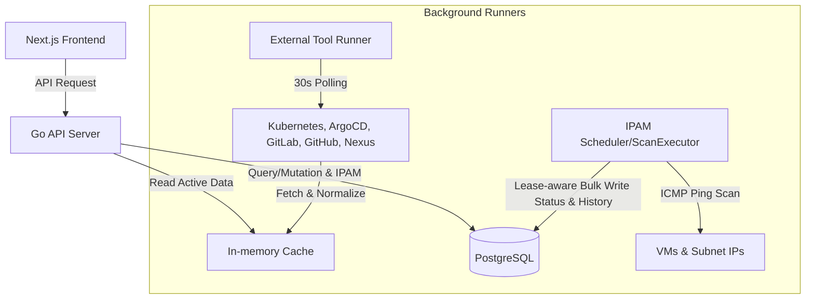

# ARCHITECTURE: Omni 시스템 아키텍처

## System Overview & Constraints
Omni는 인프라 리소스(VM, K8s, CI/CD 도구)와 IPAM(IP 주소 자원)의 상태를 통합 관리하는 포털입니다.
- **성능 격리**: 외부 시스템 API 응답 지연이 UI 성능에 미치는 영향을 최소화합니다.
- **보안 강화**: 평문 API 토큰 등 민감 정보는 PostgreSQL에 암호화하여 영속화합니다.

## Core Design Principles
1. **Performance over Absolute Real-time**: 30초 주기의 백그라운드 동기화(External Tools) 및 스케줄링 스캔(IPAM)을 통해 데이터 지연을 격리합니다.
2. **Security-by-Design**: `integration_type:integration_id:secret_name`을 AD(Additional Data)로 사용하는 AES-256-GCM 알고리즘으로 자격 증명을 암호화합니다.
3. **Decoupled Architecture**: 수집 엔진(Collector/IPAM ScanExecutor)과 API 서빙 레이어는 인메모리 캐시 및 데이터베이스를 통해 느슨하게 결합됩니다.
4. **Consistency**: 이질적인 외부 상태 데이터를 표준 상태 모델(`up`, `down`, `unknown`)로 정규화합니다.

## Technology Stack
- **Frontend**: Next.js 16.2.6 (App Router), React 19, Tailwind CSS 4, shadcn/ui
- **Backend**: Go 1.25.0, Gin Framework
- **Database**: PostgreSQL (pgx/v5)
- **Cache**: Go In-memory Cache (외부 도구 수집 데이터 공유용)

## Data & Request Flow

### 1. External Tool Data Flow (Pull-based Cache)
- `Runner`가 30초 주기로 고루틴을 실행하여 연동 대상 도구 정보 수집.
- 수집 및 정규화된 데이터는 인메모리 `Cache`에 저장되며, 사용자 요청 시 DB 조회 없이 캐시에서 즉시 반환.

### 2. IPAM Data Flow (Database-backed)
- IPAM 자원은 `Location -> Network -> Subnet -> IP Address` 계층 구조로 RDB에서 관리.
- Subnet CIDR 등록 시 사용 가능한 전체 Host IP 레코드가 데이터베이스에 자동 생성.
- `IPAM ScanExecutor`는 수동 재스캔과 Auto Discovery 스케줄 스캔의 공통 실행 경계이며, 내부에서 claim/skip/complete/fail 계약을 처리.
- 스캔 결과 반영 시 전체 IP 스냅샷을 저장하지 않고, 상태 변화(transition diff)와 스캔 요약(summary history)만 lease-aware 단일 트랜잭션으로 커밋.

## Backend Layered Architecture (`internal/`)
- **API (`api/`)**: HTTP 요청 핸들링, 라우팅 및 세션 관리.
- **Collector (`collector/`)**: 외부 시스템 어댑터 및 In-memory 캐시.
- **IPAM (`ipam/`)**: `ScanExecutor`, ICMP prober, 워커 풀, Auto Discovery 스케줄러.
- **Store (`store/`)**: PostgreSQL 접근, 트랜잭션 처리, AES-256-GCM 암/복호화.
- **Models (`models/`)**: 도메인 객체 및 공통 타입 정의.
